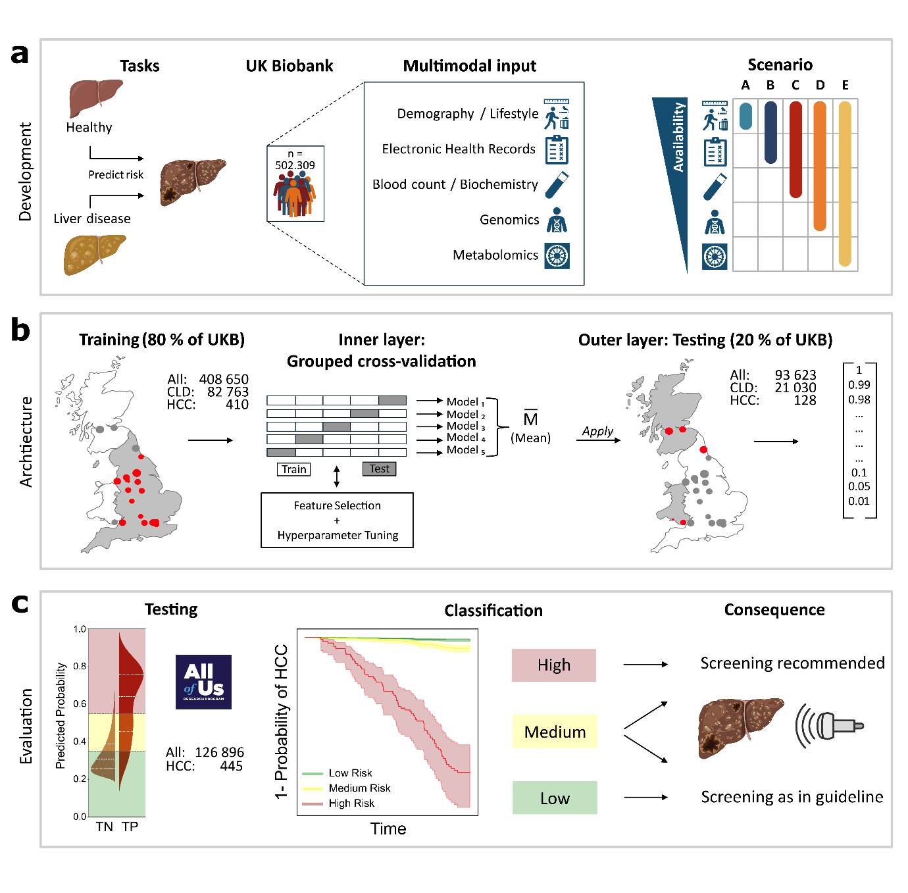

# hcc_u_soon
Preprocessing and Modeling Pipelines for the research project "Machine learning predicts liver cancer risk from routine clinical data: a large population-based multicentric study"

**Figure 1 from Clusmann et al. (2024)**

## Repository Structure
The repository is structured into three main parts:

1. **Data Preprocessing in the UKBiobank Dataset**:
    - This section contains scripts and notebooks for cleaning, concatenating, and scaling the raw data derived from the UKBiobank.
    - The user may provide a `Mastertable.xlsx` specifying the covariates and comorbidities to be included.
    - See **preprocessing_ukb**.
2. **Modeling**:
    - This section contains the code to train, evaluate, compress, and deploy machine learning models trained on the UKBiobank. The condensed, lightweight models can be deployed and externally validated.
3. **External Validation in the AllOfUs Cohort from the USA**:
    - We externally validated our lightweight, feature-reduced model by obtaining and combining the necessary information from the AllOfUs Cohort. The model performance was then evaluated against the primary training and testing data from the UKB.

As a tool for demonstration, we built a graphical user interface which can be found on [Hugging Face](https://huggingface.co/spaces/schneiderlab/ML-HCC) under this [link](https://huggingface.co/spaces/schneiderlab/ML-HCC). This is no medical device and should not influence any clinical decision.

**References**
Machine learning predicts liver cancer risk from routine clinical data: a large population-based multicentric study
Jan Clusmann, Paul-Henry Koop, David Y. Zhang, Felix van Haag, Omar S. M. El Nahhas, Tobias Seibel, Laura Žigutytė, Apichat Kaewdech, Julien Calderaro, Frank Tacke, Tom Luedde, Daniel Truhn, Tony Bruns, Kai Markus Schneider, Jakob N. Kather, Carolin V. Schneider
medRxiv 2024.11.03.24316662; doi: https://doi.org/10.1101/2024.11.03.24316662
